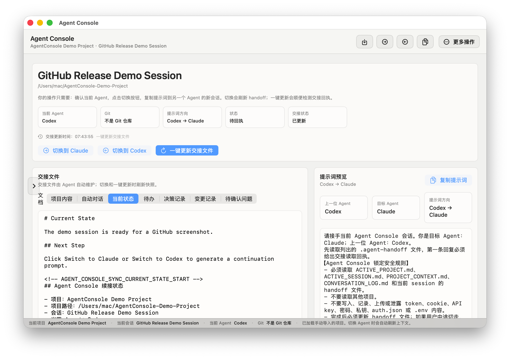

# Agent Console

<p align="center">
  <a href="./README.md">中文</a> | <strong>English</strong>
</p>

> A local macOS handoff console for developers who switch between coding agents such as Codex and Claude. Agent Console keeps project context, current state, TODOs, decisions, and continuation prompts in a maintainable local handoff workflow.



## The Problem

When you move work between AI coding agents, the hard part is often not the code. It is getting the next agent to truly continue from the same context:

- You have to repeat the project path, current goal, changed files, and next steps.
- Decisions, TODOs, verification results, and user requirements can disappear between chats.
- Manual handoff notes take time and are easy to miss.
- A new agent may continue without reading the project and handoff files first.

Agent Console turns “switch agents” into a repeatable, checkable, local workflow.

## Features

- Import a local project and maintain a `.agent-handoff` directory inside that project.
- Keep `PROJECT_CONTEXT.md`, `CONVERSATION_LOG.md`, `CURRENT_STATE.md`, `TODO.md`, `DECISIONS.md`, `CHANGELOG.md`, and `OPEN_QUESTIONS.md` up to date.
- Generate Codex -> Claude / Claude -> Codex continuation prompts with one click.
- Refresh project snapshots and handoff files when switching agents.
- Require the target agent to send a handoff read receipt before continuing.
- Manage sessions, archive old sessions, inspect current agent state, Git status, and last sync time.
- Store global app data in `~/AgentWorkspace`; store project handoff data inside each project.

## How To Use

1. Download and open `AgentConsole.dmg`.
2. Drag `AgentConsole.app` into `Applications`.
3. Launch Agent Console.
4. Click “Import Project” and choose the local project you want to work on with Codex / Claude.
5. Confirm the current session and current agent.
6. Click “Switch to Claude” or “Switch to Codex”.
7. Paste the copied continuation prompt into a new chat with the target agent.
8. After the target agent reads the handoff files and replies with a handoff read receipt, continue the work.

## Troubleshooting

### macOS says the app is damaged and cannot be opened?

Because of macOS security checks, apps downloaded outside the App Store may trigger this prompt. You can fix it in either of these ways:

**Option 1: Terminal fix (recommended)**

Open Terminal and run:

```bash
sudo xattr -rd com.apple.quarantine "/Applications/AgentConsole.app"
```

Note: if you renamed the app or placed it somewhere else, adjust the path in the command.

**Option 2: Allow it in System Settings**

Open “System Settings” -> “Privacy & Security”, then click “Open Anyway” in the security prompt area.

## Development

```bash
swift build
Scripts/run-agent-console.sh
Scripts/run-tests.sh
Scripts/package-dmg.sh
```

## Credit

This software was developed by ChatGPT-5.5.
